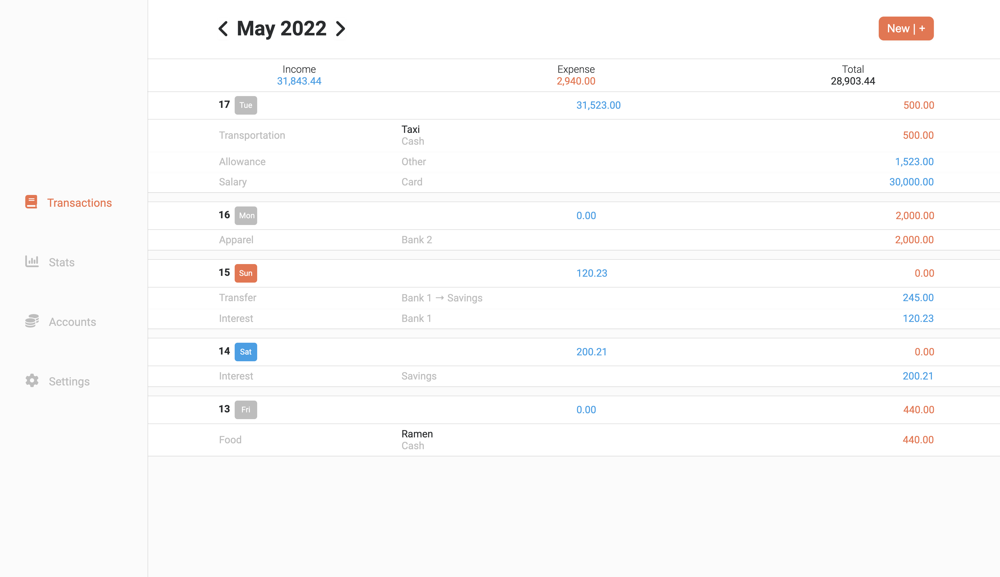
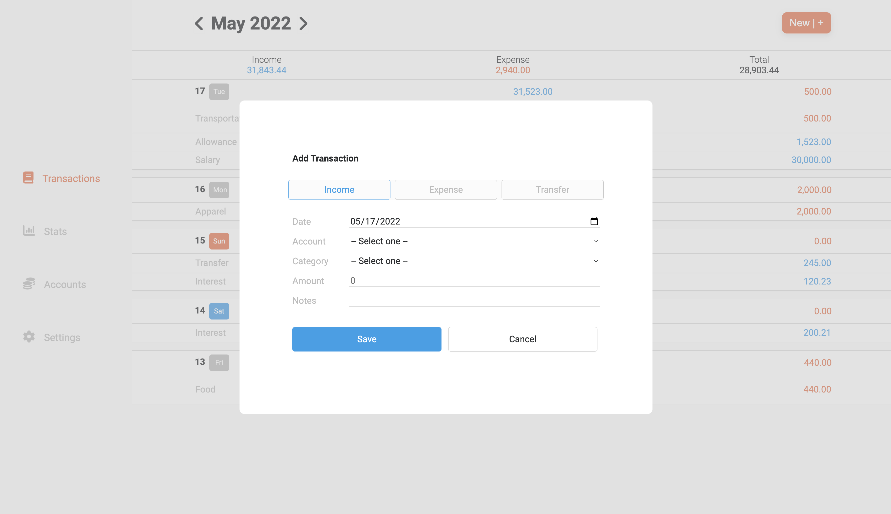
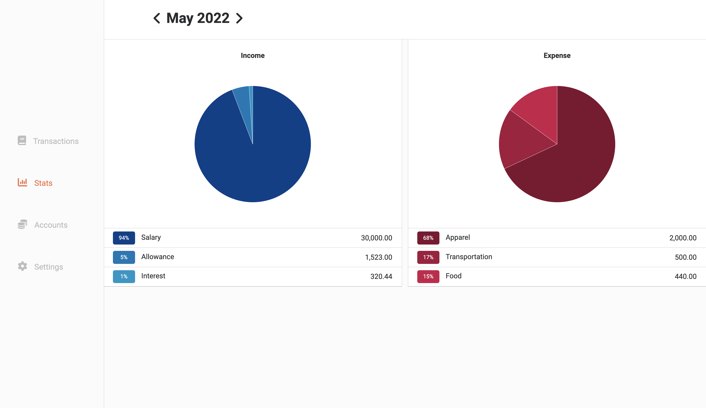
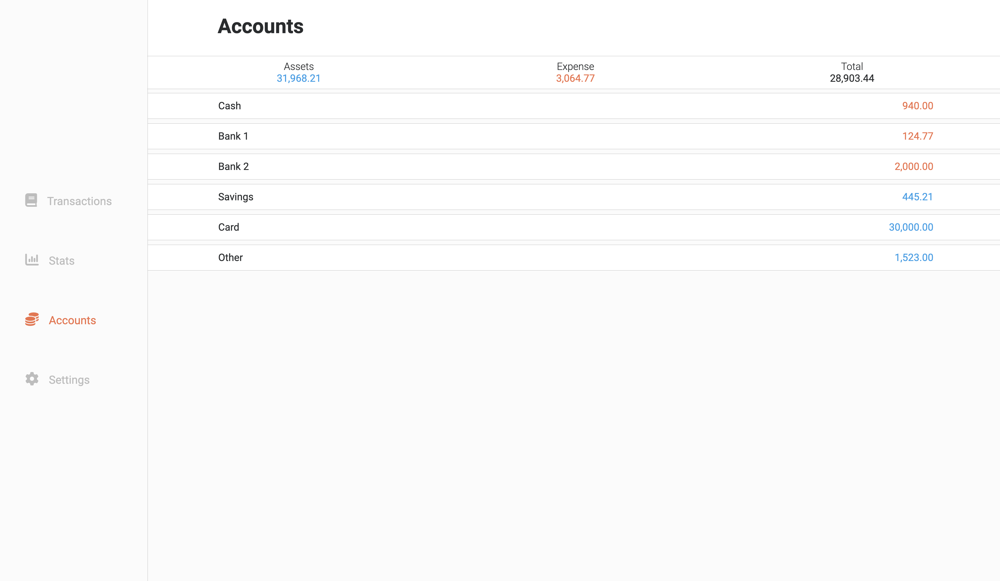
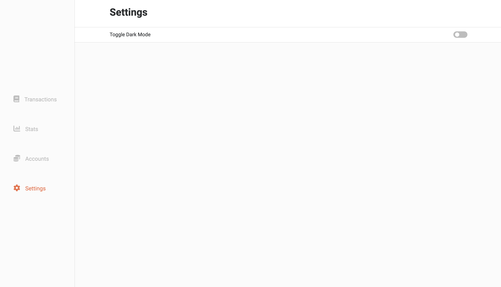
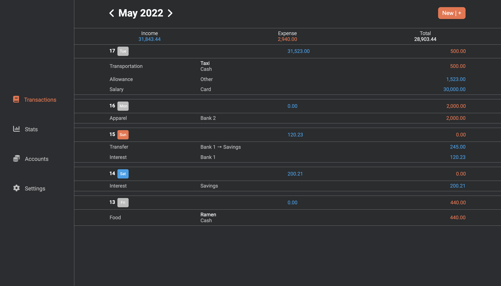
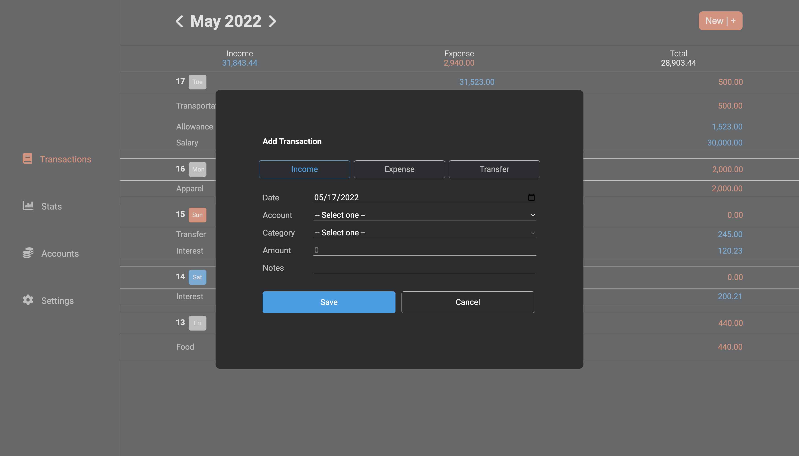
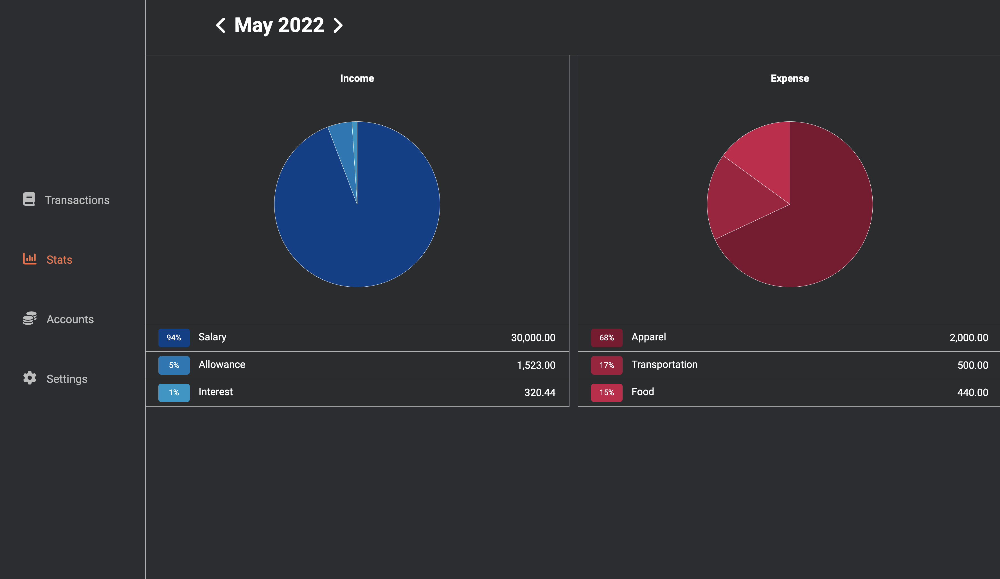
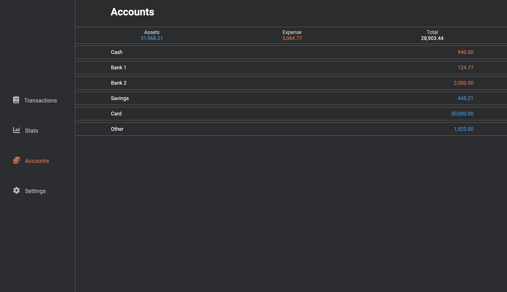
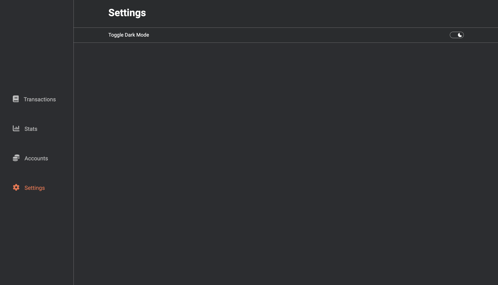

# Finance Tracker

🎟️  Live URL : https://aze-pelayo.github.io/finance-tracker/

⚒️  Status: MVP Done - Currently adding tests and looking on adding/editing accounts and categories 

**TABLE OF CONTENTS**
- [Finance Tracker](#finance-tracker)
- [About](#about)
- [Screenshots](#screenshots)
- [Setup/Installation](#setupinstallation)
- [Technologies and Tools Used](#technologies-and-tools-used)
- [My Process](#my-process)

# About

This finance tracker will allow users to:

- Log their daily income, expense, and transfer transactions.
- Have a birds-eye-view of all of their accounts.
- Get an idea on how much they earn and spend on a daily and monthly basis, as well as where this money is earned or spent.
- Switch between light and dark theme based on their preferences.

I'd like to add a React.js application in my portfolio, and this Finance Tracker is perfect since I also planned to learn more about React.js, to use different libraries that are commonly used, and to learn about styling using CSS-in-JS.

This side project is heavily inspired by the finance tracker that I personally use, which is [Money Manager Expense & Budget by Realbyte Inc.](https://www.realbyteapps.com/)

# Screenshots
☀️ Light Mode






🌙 Dark Mode







# Setup/Installation

To install:

```bash
npm install
```

To start the server:

```bash
npm start
```

To visit the app:

```bash
localhost:3000
```

# Technologies and Tools Used

- React.js
- Styled Components
- Libraries:
    - [Moment.js](https://momentjs.com/)
    - [Numeral.js](http://numeraljs.com/)
    - [Recharts](https://recharts.org/en-US/)
- Figma

This project focuses only on the frontend. I haven't included a database or a storage yet.

# My Process
When I started this project, I already envisioned it to look and function similarly as Money Manager. However, based on my experience on my other side projects, the planning phase should never be skipped as it will only lead to more chaos as I progress.

1. Planning Phase
    - Initial sketch of the project
        - Allowed me to create an idea of how the project would look like excluding the functionalities from Money Manager that I know I won't be doing.
    - Brainstorm the program/data structure of the project
        - I know that I will be using React.js in this project, so I divided my initial sketch into components based on their functionality.
        - GitHub initializing, branching strategy

2. Development Phase Part 1
    - I entered the development phase even though I haven't designed the UI of the app nor a detailed plan for the project's functionality. In a way, since I considered this project a review/practice / further studies of React, I dived right in to remember some concepts and to get my brain started in actual programming. I created the functionality of adding transactions first, and I was able to have a clearer vision of how the program structure would look like.
    - Did Form validation and moment.js experiments
        - I didn't want to use any libraries for Forms since I want to learn it from scratch.
    - Lots of arrays and object logic
        - I learned and reviewed a lot of array and object functions for this project. In a way, since I won't be using a database for this project (yet), I was able to create more complex code for complex arrays and objects.

3. Design Planning Phase
    - After I was able to create one functionality of the project, I went back to planning - this time, for the UI. I used Figma as my main tool for this.
    - A few months back, I studied how to make a Design System with Figma and how to use components. I applied my learnings to this project.
    - I may have a reference app that I can use for the designs, but I still need to research what colors and fonts I should use for this project since this will have a desktop and mobile mode (Money Manager doesn't have any desktop/web apps).
    - I did a lot of research with Dark Mode. This is my first time creating a dark mode version of the app, and I had a hard time picking which colors are suited for the design and how to make the transition from light to dark mode easily.

4. Development Phase Part 2
    - This involved the other functionalities of the project, organizing the code, a better program structure, and bug fixes.
    - Initially used React Google Charts for the pie chart under categories, but found out that Chart.js is much more suitable with the object that I will be passing to it as data.

5. Design Phase
    - Did some self-studying with styled-components first and then applied it to the whole project (for light mode). Mobile-first approach.
    - Did another round of self-studying on how to apply themes in styled-components. Eventually, I was able to apply dark mode.

6. Optimizing, Documentation
    - Made better comments, a more organized file structure, some prettier magic, and got some opinions from my friends about the project.
    - Updated the Figma file for the project.
    - README
